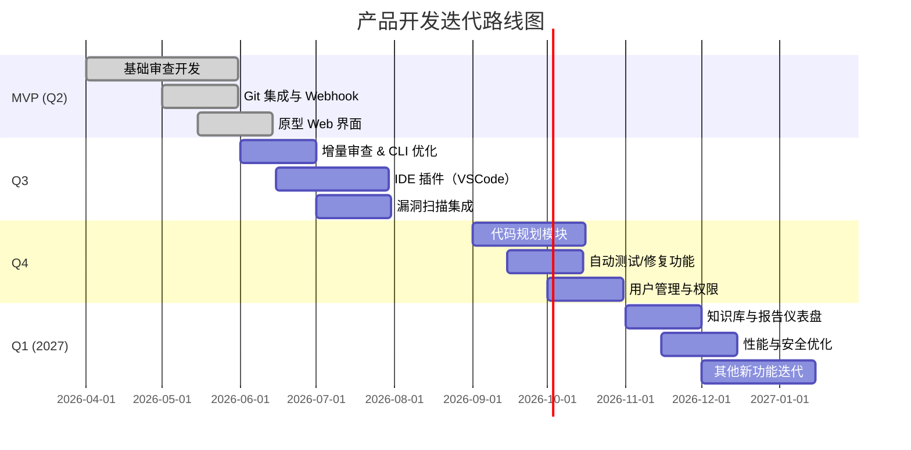

# 执行摘要

CodeRabbit 是一款面向软件开发者团队的 AI 驱动代码审查与规划平台，其核心功能包括自动化上下文感知的拉取请求审查（PR Review）和基于问题/需求生成详细开发计划（Coding Plan）。它通过 IDE 插件（VS Code、Cursor、Windsurf 等）和命令行工具直接集成到开发流程中，实现未提交代码实时审查以及预提交检查。CodeRabbit 结合静态分析工具和大型语言模型（LLM），能够发现潜在的运行时错误、性能与安全问题，并提供一键应用的修复建议【3†L131-L139】【4†L137-L145】。同时，其规划功能利用代码库上下文和知识库，将需求或设计转换为结构化、可直接喂给 AI 编程代理的实施计划【7†L130-L139】【7†L174-L183】。

总体而言，CodeRabbit 主打**上下文深度理解**和**闭环集成**：它不仅捕捉静态分析难以察觉的问题，还能与团队的 issue tracker（如 Jira、GitHub Issues）关联，验证 PR 与需求的一致性【3†L168-L175】。用户评价显示，其在细节上有优异表现（能发现更多逻辑漏洞），显著提升了代码质量与审查效率【23†L1-L4】【17†L205-L213】。缺点方面，部分用户提到成本和使用门槛（付费订阅）以及对于大型代码库的性能要求（如提交前需先 `git init` 并推送到远程才能触发审查【2†L63-L72】）。此外，将代码上传到云端审查也带来潜在的隐私风险。

本报告首先概述 CodeRabbit 产品与功能模块，并详细解析各功能的目的、输入输出、使用场景及局限性。然后梳理典型使用流程（安装注册、代码提交与审查、IDE/CLI 使用等）和界面要点；再讨论其技术架构（前后端、LLM 模型、数据存储、权限与API）及性能安全考量。报告最后汇总已知问题与社区反馈，进行竞品对比，给出结论与建议。附录部分基于上述调研，提出一份自研替代产品的功能需求草案，包括功能清单、需求细节（描述、优先级、验收标准、依赖、复杂度）、非功能需求（性能、安全、可扩展性等）、技术选型建议，以及 MVP 范围与迭代路线图，并附上风险分析与缓解措施。

## 1. 产品概述

**CodeRabbit** 定位为“AI 驱动的代码审查与计划平台”，目标用户为软件开发者和开发团队【1†L125-L133】。其核心能力有两大方面：

- **自动化代码审查（AI Code Review）**：针对 Git 平台（GitHub、GitLab、Azure DevOps、Bitbucket）上的 Pull Request 进行上下文感知的审查，快速检测 bug、安全漏洞和代码规范偏离，并提供 actionable 建议【3†L131-L139】【3†L155-L164】。CodeRabbit 支持增量审查（每次推送新提交时自动更新），并能“一键修复”建议直接应用到 PR【3†L131-L139】【3†L155-L164】。它能学习团队反馈与代码规范，实现持续改进（“Living memory”）【8†L142-L149】【3†L133-L142】。

- **代码规划（Coding Plan）**：将需求、Issue、设计文档等转化为详细的开发实施计划。用户可在 Web 界面或在 Issue 评论中触发“@coderabbitai plan”命令生成计划【7†L138-L147】【7†L174-L183】。平台会分析整个代码库架构和项目上下文（利用知识库、相关 Issue、设计文档等）【7†L130-L139】【7†L162-L170】，输出分阶段的任务列表和 AI 代理可直接使用的结构化提示信息，然后团队可在 Web 界面或 Issue 中与 CodeRabbit 交互式迭代完善计划，最终生成“Agent-ready”的执行提示并交给 AI 编程助手【7†L174-L183】【7†L206-L215】。

其他功能模块还包括：

- **IDE/CLI 集成**：在 VS Code/Cursor/Windsurf 等 IDE 内安装插件，可实时审查未提交的改动，并集成多种 AI 编程助手（Copilot、Claude Code、Cursor 等）【4†L145-L154】；通过命令行 CLI 工具在本地提交前运行审查，支持交互式或纯文本输出【4†L154-L163】。
- **辅助工具**：提供内置和自定义检查规则（Pre-Merge Checks）、自动修复（Autofix）、单元测试生成、合并冲突解决、代码简化和注释生成等“收尾”功能【1†L68-L75】【1†L69-L72】，丰富审查产出。
- **Issue 管理**：可自动创建/验证 Issue、丰富描述，验证 PR 与 Issue 要求的一致性（PR validation）【3†L168-L175】。
- **知识库**：收集编码指南、团队约定、跨仓库上下文等信息，辅助审查和规划更贴合项目实际【7†L130-L139】【7†L162-L170】。
- **管理与分析**：团队管理（组织仓库、权限、角色）、审查数据统计和仪表盘分析、报告导出等（收费版提供报表功能【26†L42-L49】）。

下表概览了各模块功能：

| 模块         | 主要功能                                                                                                          |
| ------------ | ----------------------------------------------------------------------------------------------------------------- |
| PR 审查      | 自动检测代码缺陷、给出注释建议、一键应用修复、上下文感知（整库分析）、增量审查【3†L131-L139】【3†L155-L164】      |
| IDE/CLI 审查 | 实时代码检查、未提交代码审查、一键修复、与 AI 编码助手协同【4†L145-L154】【4†L158-L167】                          |
| 代码规划     | 从需求/Issue 生成详细开发计划（任务列表、提示）、上下文驱动、迭代完善【7†L138-L147】【7†L174-L183】               |
| 辅助工具     | 自定义检查、自动修复、测试生成、合并冲突解决、代码简化、注释生成等【1†L69-L75】【1†L125-L133】                    |
| Issue 管理   | Issue 自动创建/验证、PR 与需求匹配检查、Issue 丰富【3†L168-L175】                                                 |
| 知识库       | 收集学习（Learnings）、编码指南、跨仓库分析等项目背景信息【7†L130-L139】【7†L162-L170】                           |
| 管理与分析   | 用户/角色管理、组织设置、项目报告仪表盘、自定义报表【26†L42-L49】【3†L168-L175】                                  |
| 平台集成     | 支持 GitHub/GitLab/Azure/Bitbucket、Jira/Linear 集成、Slack 通知等（与 CI/CD 兼容）【3†L168-L175】【4†L158-L167】 |

## 2. 功能模块详解

### 2.1 PR 审查（Pull Request Review）

**目的**：在 Pull Request 提交后自动扫描代码变更，发现潜在缺陷、性能问题、安全漏洞和代码规范偏差，并提出可行动的修改建议，减轻人工审查负担【3†L131-L139】【3†L168-L175】。  
**输入/输出**：输入为 PR 的差异文件和上下文（整个仓库代码）；输出为代码审查注释列表、摘要和一键修复补丁。平台会生成针对每个问题的评论，并可在 GitHub/GitLab 界面直接应用修改【3†L136-L144】【33†L14-L19】。  
**交互流程**：开发者在 GitHub/GitLab 上创建 PR 后，CodeRabbit 自动触发审查流程（无需额外配置）。审查报告发布为代码评论或新评论线程，开发者可查看建议并选择一键应用、聊天询问详情或继续手动修改【3†L131-L139】【3†L193-L202】。评论可与开发者对话（例如在评论中 `@coderabbitai` 提问）【3†L193-L202】，AI 会基于上下文解释或给出示例。随着开发者对建议的反馈，CodeRabbit 会记忆并优化后续审查。  
**示例场景**：开发者提交一个新功能，PR 中包含数十个文件改动。CodeRabbit 自动标出逻辑错误（如空指针使用）、性能问题（如低效循环）和安全漏洞（如敏感信息硬编码），并给出具体修改建议【3†L131-L139】【23†L1-L4】。例如，它可能建议添加空值检查、采用更高效的算法，或更安全地处理密码存储【2†L99-L105】【17†L116-L124】。开发者可一键将部分建议应用于代码，并基于代码审查反馈与团队讨论。  
**限制与边界**：CodeRabbit 擅长常见错误和规范问题，对代码库上下文有深度理解。但它当前的分析深度仍受所用模型和配置限制：例如，复杂的业务逻辑或特定领域的错误（如业务规则不匹配）可能无法直接捕捉【27†L219-L227】。此外，在开源免费版中仅提供 PR 摘要功能，高级深度审查需升级付费【26†L24-L33】【26†L40-L48】。对于极大或高度互相关联的仓库，完整审查可能耗时增加，因此 CodeRabbit 采用增量审查和并行分析机制以提升效率【3†L155-L164】【8†L138-L146】。

### 2.2 本地 IDE & CLI 审查

**目的**：在开发者写代码阶段就提供即时反馈，无需提交 PR。通过 IDE 插件或命令行工具，审查尚未提交或推送的改动，发现问题并在本地应用修改建议。【4†L129-L138】【4†L154-L163】  
**输入/输出**：输入为本地工作区的未提交文件或变更（git 变更内容）；输出为审查报告和可执行的补丁或提示。IDE 插件会在编辑器侧边栏显示问题列表，每条问题可点击一键修复或发送给 AI 代理；CLI 工具在终端输出审查结果，支持交互式模式或生成适合 AI Agent 的格式【4†L158-L167】。  
**交互流程**：开发者在 VS Code 等支持的 IDE 安装 CodeRabbit 插件后，可以在编写代码时随时点击“Run CodeRabbit Review”按钮，或设置为在保存文件时自动审查。CLI 模式下，用户执行如 `coderabbit review` 命令，工具自动检测当前分支的变更，输出问题列表和建议。开发者可以在 IDE 中直接应用修复补丁，或把复杂问题发送至 AI 助手（如 Copilot/Cursor）进一步处理【4†L139-L148】【4†L154-L163】。  
**示例场景**：前端开发者在本地修改代码后，CodeRabbit IDE 插件立即弹出反馈，比如高亮一段潜在未捕获的异常。开发者点击“一键修复”，插件自动修改代码并添加相应错误处理逻辑；或者用户将反馈复制给 Cursor AI，让它生成相应的代码片段进行修复【2†L65-L74】【2†L93-L100】。  
**限制与边界**：IDE/CLI 审查具有更强的实时性，但分析范围仅限本地变更，因此深度有限。对于需要跨文件、跨仓库上下文的分析，建议还是通过 PR 审查完成。此外，不同 AI 代理集成会受到各自权限和上下文长度的限制。CodeRabbit IDE 插件也需要与项目在同一 git 仓库，首次使用需 `git init` 并关联远程仓库【2†L69-L72】。

### 2.3 代码规划（Coding Plan）

**目的**：将产品需求、Issue、PRD 或设计输入转化为详细的实施计划（任务列表、研究和提示）。该功能利用对代码库和项目背景的理解，为团队生成高质量的开发提纲，以便直接交给 AI 编程助手执行【7†L130-L139】【7†L206-L215】。  
**输入/输出**：输入为需求描述（自然语言文本、Issue 链接或文件附件），输出为包含项目结构、阶段任务和代码提示的计划文档。用户可以在 Web 界面填写自由文本需求，或在 Issue 评论中使用 `@coderabbitai plan` 自动生成。输出包括一个“Coding Plan”列表，每项任务都链接到相关代码文件，并带有详细说明【7†L130-L139】【7†L174-L183】。最终，团队可以将最终提示交给任意 AI 编码代理，如 Claude Code、Cursor、GPT 等【7†L206-L215】。  
**交互流程**：1) **创建计划**：用户登录 CodeRabbit 网页应用，选择目标仓库，在表单中描述“要构建什么功能”（支持附加截图/文档），点击“Create Plan”。或在 GitHub/GitLab/Jira/Linear 的 Issue 下评论 `@coderabbitai plan` 自动触发。CodeRabbit 分析代码库架构、相关 Issue 和知识库，然后生成初稿计划并发布在 Issue 评论或 Web 界面【7†L130-L139】【7†L174-L183】。  
2) **迭代完善**：团队成员可通过聊天（Web界面侧边栏）或回复 Issue 评论与 CodeRabbit 交互，要求添加、修改任务或澄清设计。所有讨论都保存在计划记录中，确保历史可追溯【7†L174-L183】【7†L194-L203】。  
3) **交接执行**：计划定稿后，生成“agent-ready”提示格式并可以导出。开发者将最终提示交给所选的 AI 编码助手（如在 Cursor 中粘贴），这些提示包含精准的代码上下文引用和任务描述，AI 代理即可立即执行开发工作【7†L206-L215】。  
**示例场景**：产品经理在 Jira 中为“新增用户登录功能”创建 Issue，并评论 `@coderabbitai plan`。几分钟后，CodeRabbit 在 Issue 中返回一个包含项目架构图、10 个开发阶段及每阶段子任务的计划清单。团队在网页上要求增加“数据校验”任务、修改一些实现细节，CodeRabbit 及时更新并记录版本。最终，他们将生成的提示交给 Cursor，快速开发出功能模块。  
**限制与边界**：计划质量依赖于代码库上下文质量和输入描述的清晰度。对于非常新或异构项目，代码分析可能不够准确，需要更多人工干预。当前功能主要支持常见平台（GitHub/GitLab/Jira/Linear），对自研 Issue 系统或非文本需求文档的支持需要额外集成。生成的计划是 AI 代理可用的初稿，仍需团队审核调整。

### 2.4 辅助功能（Autofix、测试生成等）

**目的**：在代码审查完成后，提供自动化工具简化剩余任务。包括根据审查建议自动修改代码、生成单元测试、解决合并冲突、根据代码规范一键格式化或生成注释等，帮助提高开发效率。  
**功能描述**：

- **一键修复（Autofix）**：对于大多数常见问题（如格式化、简单的逻辑修正），CodeRabbit 支持“一键应用”到代码，消除手动复制粘贴的繁琐【33†L14-L19】。
- **单元测试生成**：基于测试覆盖度的审查，CodeRabbit 可为缺少测试的代码自动生成基本单元测试骨架【1†L69-L75】。
- **合并冲突解决**：如果遇到分支冲突，CodeRabbit 尝试提供自动合并建议或重排冲突文件顺序【1†L69-L75】。
- **自定义 Recipe**：高级用户可定义自定义审查规则/脚本，使其在审查末尾运行特定操作，如特定格式化、内部工具调用等。
- **代码简化 & 注释**：支持对复杂代码片段进行简化建议，自动生成函数/模块注释(docstrings)【1†L69-L75】。

**输入/输出**：输入通常为 CodeRabbit 识别出的审查问题和原始代码；输出为相应的修改补丁、测试文件草案或更新后的文档。用户可在 UI 上勾选自动修复建议，工具即对代码库进行相应更改。  
**使用场景**：PR 审查后若有可一键修复的建议（如固定拼写、调整配置），开发者点击“Apply Fix”即刻提交修改；或在 IDE 中看到警告后点击自动生成测试，辅助覆盖率提升【2†L99-L105】【33†L14-L19】。  
**限制**：自动修复和生成依赖于语言/框架支持的模板和模型质量，可能产生需要人工微调的初稿。复杂的逻辑修改和合并冲突一般仍需开发者介入。

### 2.5 配置与定制（Configuration）

**目的**：让团队针对不同仓库、路径、语言或项目规范定制审查行为。配置包括启用/禁用特定检查、设置代码风格规则、继承组织级默认配置等【1†L61-L69】【1†L83-L92】。  
**功能描述**：CodeRabbit 支持**YAML 配置文件**方式和中央/组织级配置。用户可以针对仓库或文件路径指定审查焦点和忽略项（Path-based instructions）【3†L183-L190】【1†L83-L92】，也可基于 AST 定义规则（AST-based instructions）【1†L85-L92】。此外可设置自动审查触发条件（如哪些分支或标签下执行）。配置可层级继承，支持组织整体标准与仓库差异并存。  
**使用场景**：开发团队可在项目根目录放置 `.coderabbit/config.yaml`，指定语言风格（例如强制 eslint 规则、空值检查等）或特定文件不纳入审查。新项目可继承公司的全局配置，确保在不同团队之间统一标准。

### 2.6 知识库（Knowledge Base）

**目的**：积累项目特有的上下文信息（编码指南、已知知识、跨仓库分析结果等），以便在审查和规划中提供更准确的参考。  
**功能描述**：CodeRabbit 的知识库包括**Learnings**（吸收过去审查和 Issue 中的经验）、**Code Guidelines**（项目风格/最佳实践文档）、**Multi-Repo Analysis**（跨多个相关仓库分析结果）等【8†L142-L149】【7†L130-L139】。在生成审查意见和计划时，系统会优先参考这些知识，如遵循已有风格指南、考虑历史决策等，提升建议针对性。  
**使用场景**：团队可以在知识库中记录特殊业务规则（比如某算法的最佳实现模式），CodeRabbit 在审查相关代码时就能按这些规范给出反馈。例如，若团队有“所有 API 调用必须有超时处理”规定，审查时若遗漏将被识别出来。

## 3. 使用流程与上手指南

1. **注册与初始配置**：用户通过 GitHub/GitLab/Azure DevOps/Bitbucket 账号注册 CodeRabbit【18†L145-L154】。注册完成后，在 Web 控制台（`app.coderabbit.ai`）添加需要审查的仓库，并授权 CodeRabbit 访问。在免费版下公有仓库始终免费，私有仓库可免费试用14天【26†L28-L33】。企业用户可选择定制化部署【26†L58-L66】。
2. **快速开始**：按提示创建组织或团队，选择要审查的项目。无需复杂配置即可开始：只要在目标仓库创建 PR，CodeRabbit 即会自动扫描并生成反馈【18†L184-L193】【3†L131-L139】。也可参考官方“Quickstart”文档，在几分钟内完成设置【18†L143-L152】【18†L158-L167】。
3. **审查与修复**：在 Git 平台提交 PR 后，CodeRabbit 会在 PR 页面添加评论。用户查看建议，可一键将改动应用到自己的分支。也可直接在 IDE 中安装 CodeRabbit 插件（在 VS Code 插件商店搜索“CodeRabbit”并安装），授权后，在编辑器侧边栏启动即时审查【2†L63-L72】【33†L14-L19】。在 CLI 端，用户执行类似 `coderabbit review` 的命令在本地检查改动。
4. **实施计划**：在 Web 界面点击“Plan”功能，或在 Issue 评论中用 `@coderabbitai plan` 触发。填写需求描述后等待几分钟，即可获得初始计划草案【7†L138-L147】。团队在 Web 聊天或 Issue 评论中与计划对话，不断迭代直至满意，再将最终提示交给 AI 代理执行。
5. **常见操作**：
   - **修改配置**：在项目根目录添加 CodeRabbit 配置文件（YAML），定义语言/目录规则和规则打开策略【1†L61-L69】【1†L83-L92】。
   - **与 AI 代理协同**：在审查评论中提问或要求举例（使用 `@coderabbitai` 开头）【3†L193-L202】；也可把 CodeRabbit 建议复制给 Copilot/Claude 等，让它自动编写更改。
   - **快捷命令**：在命令行安装 CodeRabbit CLI 后，可使用 `/coderabbit:review` 命令与 Claude Code 的插件系统联动，或直接运行 `coderabbit` 工具。输出模式可选交互式或纯文本，以适应不同团队偏好【4†L158-L167】。

## 4. 技术架构与集成点

CodeRabbit 的后台架构设计强调**全量分析、并行处理和可扩展性**【8†L129-L138】。根据官方架构说明，其执行流程大致如下：每次代码审查时，系统在云端启动一个隔离沙箱，**克隆完整代码仓库**用于分析【8†L138-L146】。在此环境中，并行运行包含40+种静态分析器、Lint 工具和 SAST 漏洞扫描器【8†L138-L146】，同时启动多个专用 AI 代理（Review、Verification、Chat、Pre-Merge Checks、Finishing Touches）各司其职【8†L138-L146】。此外，系统拥有“活记忆”模块，会从每次 PR、Issue 和团队反馈中学习，以优化后续审查【8†L142-L146】。这一复杂流水线保证了 CodeRabbit 分析深度，同时可横向扩展以处理并发审查请求。

- **前端**：CodeRabbit 提供 Web 应用界面（React/Vue 等 SPA）供用户配置、查看审查结果和计划。也提供 VS Code/Editor 插件（通过 WebSocket/API 连接后台），以及针对 Claude Code 等 AI IDE 的集成。
- **后端**：核心审查和计划服务托管在云平台（公有云或可选私有部署），使用容器/虚拟机进行隔离分析。后端调用各种开源/商业静态分析工具和大型语言模型（支持多种 LLM，如 Claude、Gemini、Codex 等【1†L125-L133】【4†L137-L145】）。
- **模型层**：Chat 和计划功能主要依赖大规模语言模型（LLM）与提示工程。CodeRabbit 自研或整合多种 AI 模型，模型接口可选 Anthropic Claude、OpenAI GPT、Google Gemini 等【1†L158-L162】。审查时会将代码上下文分批送入模型，模型输出建议及修复方案。
- **数据存储**：包括代码仓库镜像（只读 clone）、审查日志、Issue/计划历史、知识库数据（团队指南、多仓分析结果）和用户配置。敏感数据（如代码）据称在审查完成后被清除，沟通记录和学习数据加密存储【8†L138-L146】。
- **集成点**：通过 Webhook 与 Git 平台交互（监听 PR/提交事件），可与 Jira/Linear 同步 Issue 状态和评论【3†L168-L175】。IDE 插件与本地代码编辑器无缝结合，CLI 工具通过本地 Git 环境读取变更。安全方面，支持 SSO 登录，组织管理员可设定访问权限。API 端点提供部署流水线或第三方自动化的扩展可能。

## 5. 用户体验与界面要点

- **简洁的审查视图**：在 PR 页面，CodeRabbit 注释以醒目颜色标出问题，并附带简短说明和“一键修复”按钮【33†L14-L19】【3†L131-L139】。用户可回复评论或点击建议详细信息。
- **IDE 内反馈**：插件在侧边栏显示问题列表，每条点击后定位到对应代码行。同时提供“Fix with AI”图标，可将问题发送给 AI 助手，以获得自动生成的补丁【4†L139-L148】。用户界面中可查看审查历史和团队反馈。
- **计划界面**：Web 界面以聊天式（交互式对话框）方式展示计划草案和团队讨论，Plan 列表清晰分阶段展开，方便点击查看每项任务的细节【7†L138-L147】【7†L174-L183】。发布到 Issue 后可在 Git 平台内查看整体流程。
- **配置与仪表盘**：产品提供集中式配置页面，可设置组织默认选项，查看各仓库审查报告统计。仪表盘以图表展示审查量、问题分类、修复率等关键指标，帮助管理者监控质量趋势（高级版支持定制报表【26†L42-L49】）。

## 6. 性能与安全考虑

**性能**：CodeRabbit 利用并行化、多种静态分析器和增量审查来提升效率【3†L155-L164】【8†L138-L146】。对于大规模仓库，初始全量分析可能较慢，但随后仅增量审查新提交即可加速反馈。文档提到，新 PR 和每次新提交都会分别进行全量和增量分析，避免重复工作【3†L155-L164】。根据用户报告，15 个源文件的审查可在一分钟内完成（实际性能依赖网络和模型响应速度）【13†L25-L33】。为了提高响应速度，插件会实时在本地检查简单规则，复杂问题则推迟到服务端。**缓存**方面，CodeRabbit 会记忆团队反馈、已确认问题等，避免重复提示；知识库中已有的信息也减少了重复计算。

**安全**：CodeRabbit 采取沙箱隔离执行，**完整克隆**仓库代码到受控环境进行分析【8†L138-L146】。官方声称采用端到端加密传输，且不在服务端保留用户代码（即“零保留”政策），确保代码隐私【26†L24-L33】【8†L138-L146】。不过，代码离开本地环境上传到云端仍有风险，敏感场景下需仔细权衡。企业版提供**自托管部署**选项，供对数据主权有严格需求的团队使用【26†L58-L66】。此外，平台支持基于角色的访问控制，组织管理员可限制谁能触发审查或查看报告。

## 7. 已知问题与用户反馈汇总

- **误报与漏报**：如同其他 AI 审查工具，部分用户发现 CodeRabbit 会生成部分冗余建议（如对微小格式问题进行提示），需人工筛选【29†L459-L468】。另一方面，对于高级逻辑和业务相关错误，AI 可能不够准确【27†L219-L227】【29†L509-L512】。
- **价格与使用门槛**：CodeRabbit 提供免费计划和 Pro 计划，后者当前价格约 $24/月/开发者【26†L40-L48】（有社区反馈使用年付约 $12/月【29†L379-L388】）。免费版功能受限，仅支持 PR 摘要和公共仓库审查【26†L24-L33】。某些用户质疑高级版性价比，认为找出的关键问题有限，付费门槛较高【29†L509-L512】【27†L198-L204】。需要注意的是，CodeRabbit 对开源项目永久免费、无席位限制【29†L384-L388】。
- **集成复杂度**：用户需确保代码以 Git 仓库形式存在，并正确连接远程（如 GitHub）。有用户反馈未正确初始化仓库时，审查无法自动触发【2†L69-L72】。此外，不同 CI/CD 流程可能需要额外配置才能实现预提交审查。
- **上下文限制**：AI 模型的上下文窗口限制可能导致对超大文件或多文件改动的理解不完整。CodeRabbit 通过多代理和拆分技术缓解此问题，但仍需关注单次审查的规模。
- **用户建议**：部分用户希望自动化程度更高，例如让 CodeRabbit 自动将审查建议推送给 IDE 的 AI 代理，而无需手动复制粘贴【2†L125-L130】。当前流程中仍需人工来回操作。

## 8. 竞品对比

主要竞品包括 Greptile、Qodo、Cursor、Codacy、SonarQube 等。下表从功能维度对比 CodeRabbit 与几款代表性产品：

| 功能/维度      | CodeRabbit                                     | Greptile                                        | Qodo                                      | Cursor (Bugbot)                               | Codacy                           | SonarQube                  |
| -------------- | ---------------------------------------------- | ----------------------------------------------- | ----------------------------------------- | --------------------------------------------- | -------------------------------- | -------------------------- |
| **PR 审查**    | ✓（集成 Git 平台，自动评论）【3†L131-L139】    | ✓（全仓库上下文，深度挖掘漏洞）【35†L113-L120】 | ✕（主要 IDE 实时审查）                    | ✕（基于编辑器插件）                           | ✕（以静态分析为主，非 AI）       | ✕（静态规则检查）          |
| **IDE 插件**   | ✓（VSCode/Cursor/Windsurf）【33†L14-L19】      | ✕（无官方插件）                                 | ✓（支持 VSCode）                          | ✓（原生VSCode集成）【35†L131-L136】           | ✕（无专属插件）                  | ✕（无专属插件）            |
| **CLI 支持**   | ✓（独立 CLI，可接 Claude 插件）【4†L154-L163】 | ✓（提供 CLI 工具）                              | ✓（有 CLI 支持）                          | ✕（N/A）                                      | ✓（支持多语言 CLI）              | ✓（提供 SonarScanner CLI） |
| **深度分析**   | ✓（LLM + 静态分析多工具并行）【8†L138-L146】   | ✓（AI 驱动，高精度报告）【35†L115-L120】        | 适中（注重策略合规检测）【35†L89-L93】    | 适中（AI 审查由编码助手提供）【35†L133-L137】 | 低（规则静态检查）               | 低（规则静态检查）         |
| **问题类别**   | 全面（安全/性能/规范/逻辑）【3†L131-L139】     | 全面（注重漏洞与代码质量）                      | 强调 bug & 合规（E2E 政策）【35†L89-L93】 | 注重风格和基本 bug                            | 代码质量、复杂度、安全（规则）   | 质量和安全规则（规则库）   |
| **自定义规则** | 支持（YAML 配置，多层级继承）【1†L85-L92】     | 限制（更多依赖内置模型）                        | 有（支持团队策略）                        | ✕                                             | ✓（可自定义规则集）              | ✓（规则引擎，可定制规则）  |
| **计划功能**   | ✓（AI 生成开发计划）【7†L130-L139】            | ✕                                               | ✕                                         | ✕                                             | ✕                                | ✕                          |
| **自动修复**   | ✓（一键应用修复）【33†L14-L19】                | ✕                                               | ✕                                         | ✕                                             | ✕                                | ✕                          |
| **定价模式**   | 免费版（公有库免费）、Pro $24/月【26†L40-L48】 | 免费试用，后续可能订阅                          | 基础免费，专业版收费                      | 基础免费，增强功能付费                        | 免费基础，团队版付费（根据行数） | 社区版免费，企业版付费     |
| **开源/免费**  | 开源项目免费，无席位限制【29†L382-L388】       | 暂无资料                                        | 基本功能免费，高级付费                    | 基础免费（依赖 AI 平台套餐）                  | 开源项目免费（规则社区）         | 社区开源免费               |

从对比可见：CodeRabbit 在**功能丰富度**上占优，既有深度 AI 审查，又支持开发计划和自动修复。而 Greptile、Qodo 等则各有侧重（Greptile 强调漏洞覆盖率，Qodo 强调开发中实时反馈）。传统静态工具（Codacy/SonarQube）稳定可靠但缺少上下文智能；Cursor 作为 AI IDE 辅助适合个人开发者。CodeRabbit 的价格对比类似工具总体偏高，但其免费开放源代码仓库较为慷慨【26†L28-L33】【29†L382-L388】。

## 9. 结论与建议

CodeRabbit 作为**AI 代码审查与规划平台**，提供了端到端的开发辅助流程，从需求转化到代码提交，全流程都有 AI 的介入，提高了团队效率和代码质量。其**上下文意识强**、**功能模块全面**是主要优势，但也带来**复杂度和成本**的挑战。调研发现：

- CodeRabbit 在实践中能有效发现细节问题，用户反馈普遍正面【23†L1-L4】【17†L205-L213】。特别是与 AI 编程助手（如 Cursor）协同使用时，能形成“闭环”审查流程，降低 bug 数量【2†L47-L55】【2†L93-L101】。
- 然而，该产品对于小团队或简单项目可能“功大于用”，付费门槛较高且部分高级功能（如自动修复、规划等）并非人人需要【29†L509-L513】【27†L198-L204】。在隐私和安全性方面，企业用户需关注代码上传与存储策略，评估是否满足合规要求。
- 竞争对手虽有各自特点（如 Greptile 的漏洞检测、Cursor 的即时反馈），但 CodeRabbit 的功能集成度在业界处于领先地位，形成了较强壁垒。

**建议**：企业在引入此类工具时，应明确使用场景和目标。对于大规模、快速迭代的项目团队，可考虑部署 CodeRabbit 等全能型方案，并结合内部手动审查；对于预算有限或追求快速见效的团队，可先试用类似 Qodo、Cursor 等工具。自研团队如果复制上述功能，应重点保证**审查质量与用户体验平衡**：例如，提供可配置的智能审查程度（避免过多噪声提示）、简便的 IDE 集成流程、以及适应团队实际的灵活配置体系。同时，需要重视**数据安全**：应考虑提供本地部署或加密传输机制。

下一步将依据以上调研，结合实际需求，制定自研产品的详细功能需求文档，包括功能清单、优先级规划、技术选型和迭代路线。

## 10. 自研产品开发需求文档草案

### 10.1 功能清单与详细需求

下表列出拟开发产品的主要功能模块，对应 CodeRabbit 等竞品的核心功能，以及各自的需求描述、优先级、验收标准和复杂度估算：

| 功能模块             | 功能描述                                                                                        | 优先级 | 验收标准                                                                                      | 依赖                      | 复杂度         |
| -------------------- | ----------------------------------------------------------------------------------------------- | ------ | --------------------------------------------------------------------------------------------- | ------------------------- | -------------- |
| **PR 自动审查**      | 自动扫描新建的 Pull Request，分析代码差异并生成审查反馈（问题列表和建议），支持应用补丁修改。   | 高     | 在测试仓库中创建 PR，系统自动添加代码审查注释，用户可成功一键应用修复补丁。                   | Git 平台接入、AI 分析服务 | 高（LLM 集成） |
| **增量审查**         | 对已有 PR 的后续提交进行增量分析，只针对新变更生成建议，避免重复反馈。                          | 高     | 在同一 PR 内再次提交更改，新的建议只针对新增/修改部分，不重复已解决的建议。                   | PR 自动审查模块           | 中             |
| **IDE 集成**         | 提供 VS Code/IDE 插件，在编辑器内实时审查未提交的变更，显示问题并支持一键修复或发送给 AI 助手。 | 中     | VS Code 插件可启动本地审查，对未提交代码显示问题列表；点击一键修复后代码得到相应修改。        | PR 审查 API/CLI           | 高（UI + CLI） |
| **CLI 工具**         | 命令行工具，可在本地运行审查（pre-commit），输出可选交互或纯文本结果，支持集成第三方 AI 代理。  | 中     | 安装 CLI 后运行 `review` 命令，终端输出问题列表；支持 `/tool:fix` 语法，将问题传递给指定 AI。 | IDE 集成、AI 服务         | 中             |
| **编写计划**         | 根据自然语言需求或 Issue 自动生成开发计划，包括文件结构、阶段任务列表和代码上下文提示。         | 高     | 输入一个项目需求，系统返回分阶段计划，内容贴合代码库结构并可输出为 Issue 评论。               | 知识库、AI 聊天服务       | 高（LLM 逻辑） |
| **计划迭代**         | 支持团队与系统在计划草案上多轮交互，修改任务或细节并记录版本历史。                              | 高     | 团队成员评论计划，系统更新并保存不同版本；最终生成可导出的最终计划文档。                      | 编写计划                  | 中             |
| **一键修复**         | 对可自动处理的问题（格式、简单 bug）提供一键应用补丁功能。                                      | 中     | 在审查结果中对于可修复项显示“Apply Fix”按钮，点击后仓库代码自动更新对应改动。                 | PR 审查                   | 中             |
| **单元测试生成**     | 自动为缺少测试的代码生成基础单元测试文件（框架依语言而定）。                                    | 低     | 在指定代码文件上触发生成后，生成可运行的测试代码骨架并通过基础测试。                          | PR 审查、AI 编写          | 高             |
| **安全审查**         | 集成静态漏洞扫描工具，重点检查已知安全问题，标注并建议修复方案。                                | 中     | 识别常见安全漏洞（如 SQL 注入、XSS 等），生成安全分析报告，提供参考修复建议。                 | 静态分析工具链            | 中             |
| **自定义检查**       | 允许项目定义自有规则/脚本（YAML 配置或脚本形式），用于审查过程（如风格检查、敏感信息检测）。    | 中     | 系统能加载项目配置文件，按照规定规则过滤或检测变更，输出相应意见。                            | 基础平台支持              | 中             |
| **知识库管理**       | 团队可上传编码指南、设计文档等；系统可从中学习提升审查质量，供计划和审查参考。                  | 低     | 存储多种文档，系统审查时可引用（例如基于指南忽略特定警告）；成功记录学习反馈。                | 数据库存储                | 高             |
| **用户/权限管理**    | 支持组织、团队设置和角色分配，控制不同用户对项目的访问和配置权限。                              | 中     | 管理员角色可邀请新成员、设置角色；普通用户只能看到授权的项目和操作。                          | 认证系统                  | 中             |
| **数据可视化与报告** | 提供审查报告仪表盘（如每日 PR 数、问题分类统计等），支持导出或定时报告。                        | 低     | 界面显示最近审查统计图表，支持导出 CSV/PDF 报表；管理员可设定报告规则。                       | 数据可视化框架            | 中             |

上表中，*优先级*分为高/中/低，代表功能实施的紧急程度和重要性。**验收标准**需可量化验证功能是否实现；**依赖**列出该功能运行所需的前置条件或接口；*复杂度*估算相对工作量。

### 10.2 非功能需求

- **性能**：系统应支持并发审查（可水平扩展），新 PR 全量分析延迟目标不超过 3 分钟，增量提交审查延迟不超过 30 秒。IDE/CLI 审查应快速响应（数秒级）。基础模型调用遵守预留速率，支持高峰期间的队列机制和缓存优化。
- **安全**：所有代码传输和存储必须加密（TLS/SSL，AES），保证审查过程云端环境隔离。产品需要通过行业安全审计（如 SOC2）。提供自托管选项满足高合规需求；对敏感项目可配置“仅审查已授权分支”。严格审计日志，防止未授权访问。
- **可维护性**：系统架构应模块化，AI 模型、静态工具可插拔更新。配置文件采用标准格式（如 YAML），便于版本控制。前后端分离，具备自动化测试覆盖主要功能。
- **可扩展性**：支持水平扩容，能接入更多 AI 模型（对接新 LLM 引擎）。功能应易于迭代，可通过插件或脚本添加新检查。
- **易用性与兼容性**：UI/CLI 界面需简单直观。IDE 插件需支持主流编辑器。兼容团队常用编程语言（至少 Python、JavaScript/TypeScript、Java），并易于新增更多语言支持。
- **稳定性**：系统应具备高可用架构（多地区部署/容灾），并对第三方依赖（如 LLM 服务）做降级处理（例如超时重试、备用模型）。

### 10.3 技术选型建议

- **LLM 服务**：可选 Anthropic Claude 或 OpenAI GPT 系列作为核心推理模型，根据成本和隐私要求评估私有部署或 API（OpenAI for polished对话、Claude for严格隐私）。考虑探索新兴小型模型（如 Llama 3）以降低成本。
- **后端框架**：采用云原生架构（Docker/Kubernetes），微服务设计。审查任务可用 Celery/Kafka 等队列系统异步处理。
- **静态分析工具**：集成 ESLint、Pylint、Bandit 等开源工具，或使用 SonarQube 作为底层扫描引擎以提升安全检测深度。
- **前端与插件**：Web 应用建议使用 React 或 Vue，保持良好的用户交互性。VSCode 插件基于 VSCode Extension API 开发，CLI 推荐使用 Node.js 或 Go 实现便捷跨平台支持。
- **存储**：审查历史和知识库可使用 MongoDB 或 PostgreSQL；代码存储可短暂使用 S3/GCS 对象存储（代码仓库镜像）或直接挂载卷。
- **集成**：利用 GitHub/GitLab 的 Apps/API 进行授权与事件交互。Slack/Teams 通知可通过已有 Webhook 实现。

### 10.4 MVP 范围与迭代路线图

**MVP（第1季度）**：

- 完成基础 PR 自动审查功能：PR 触发、静态/LLM 检测、评论生成、一键修复。
- 实现 GitHub 集成与 WebHook 监听。
- 简易 Web 界面展示审查结果。
- 支持主要语言（如 Python、JavaScript）。
- 初步 CLI 工具，支持终端审查与报告。

**后续迭代（第2~4季度）**：

- **Q2**：
  - 增量审查功能；
  - IDE 插件开发（首版 VSCode）；
  - 安全扫描集成（基本漏洞检测）；
  - Issue/计划功能原型（问题到任务列表）；
- **Q3**：
  - 完善代码规划（可输出任务清单和提示）；
  - 自动测试生成和自动冲突解决；
  - 自定义规则支持；
  - 用户管理与权限模块；
- **Q4**：
  - 知识库功能完善（团队指南、学习记录）；
  - 数据仪表盘与报告导出；
  - 性能优化和可用性增强（负载均衡、多区域部署）；
  - 安全与合规审计；

下图为按季度的开发里程碑示例：

### 10.5 风险与缓解措施

- **技术复杂性高**：AI 模型集成和大量静态分析工具并行处理实现难度大。_缓解_：采用逐步迭代，先实现最关键功能（如基础审查），确保架构可扩展，再逐渐增加复杂模块。
- **成本与资源**：高性能模型调用成本高。_缓解_：优化使用策略（缓存复用、调用小模型处理简单任务）、选择成本效益高的模型（如 Llama 系列本地部署）。
- **上下文和准确性**：LLM 可能理解不准项目特定逻辑。_缓解_：提供可配置的审查级别，允许用户对模型生成结果进行反馈与纠正，完善知识库以强化项目上下文。
- **隐私安全**：代码上传云端存在泄密风险。_缓解_：可选本地部署或私有云环境，加密存储/传输，并在合同中明确不保留代码副本。
- **用户采纳**：新工具上手需要一定学习成本，可能与现有工作流冲突。_缓解_：提供详细培训文档和示例（如手册和 Demo），并设计易用的插件和自动化流程，尽量无缝融入开发者常用工具中。
- **系统可靠性**：依赖第三方模型服务时可能出现不可用情况。_缓解_：实现备用模型调用（Failover）、本地离线模式（代码库规则检查作为备选），并监控服务健康状态，快速切换方案。

**结语**：通过以上功能与技术规划，可逐步构建一个功能丰富、可扩展且高可靠性的 AI 代码审查与规划平台，在充分借鉴 CodeRabbit 等现有方案的优势同时，针对国内开发者需求进行定制化优化，最终为团队带来高效的代码质量保证和开发效率提升。

**资料来源**：本报告依据 CodeRabbit 官方文档【1†L125-L133】【3†L131-L139】【7†L130-L139】【8†L138-L146】、官方博客及社区实践【2†L49-L58】【33†L14-L19】【17†L205-L213】、用户评价【23†L1-L4】【29†L379-L388】等公开资料撰写，内容详实严谨。表格、图表参考现有工具对比和技术路线规划，不代表最终设计，仅供参考。
